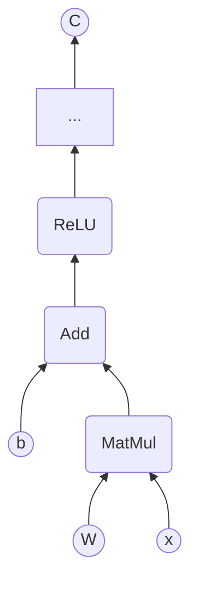

# AI我的收藏学习笔记

## 包含AI ML DL TF 等等所有AI领域的

### 从百度Google搜索关键字阅读大量网页来学习

AI 算法

深度学习知识

深度学习算法

深度学习模型

##### 多层感知机

##### 全连接神经网络

##### CNN 卷积神经网络

AlexNet、VGGNet、Inception Net、ResNet

##### RNN 循环神经网络

Word2Vec、RNN、LSTM

Deep Q-Network

##### 强化学习

基于深度学习的策略网络和估值网络

##### 自编码器

TensorFlow 知识 原理

TensorBoard

单机多GPU并行  分布式并行

##### 深度学习框架对比

TensorFlow、Caffe、Keras、CNTK、Torch7、MXNet、Leaf、Theano、DeepLearning4、Lasagne、Neon等等

##### TensorFlow 的 contrib.learn 模块

许多类型的深度学习及流行的机器学习算法的使用方法

解析了contrib.learn模块的分布式 Estimator 的基本架构

如何使用 Estimator 快速搭建自己的分布式机器学习模型架构，进行模型的训练和评估

如何使用监督器更好地监测和跟踪模型的训练

使用 DataFrame 读取不同的数据格式

##### Contrib 模块

Contrib 模块提供了许多机器学习需要的内容，包括：

统计分布、机器学习层、优化函数、指标等

通过 TensorFlow 实现各类神经网络

##### Google的开源项目

Android、Chromium、Go、JavaScript引擎 V8、

数据交换框架 Protobuf、

编译工具 Bazel、

OCR 工具 Tessecract

##### Inception Net等

ImageNet MNIST Cifar-10


# 详细内容

计算图示例：

```python
import tensorflow as tf
b=tf.Variable(tf.zeros([100]))  # 生成100维的向量，初始化为0
W=tf.Variable(tf.random_uniform([784,100],-1,1))  # 生成 784*100 的随机矩阵 W
x=tf.placeholder(name="x")  # 输入的Placeholder
relu=tf.nn.relu(tf.matmul(W, x)+b)  # ReLU(Wx+b)
C=[...]  # 根据ReLU函数的结果计算Cost
s=tf.Session()
for step in range(0, 10):
    input=...construct 100-D input array... # 为输入创建一个100维的向量
    result=s.run(C, feed_dict={x: input})  # 获取Cost，供给输入x
    print(step, result)
```



