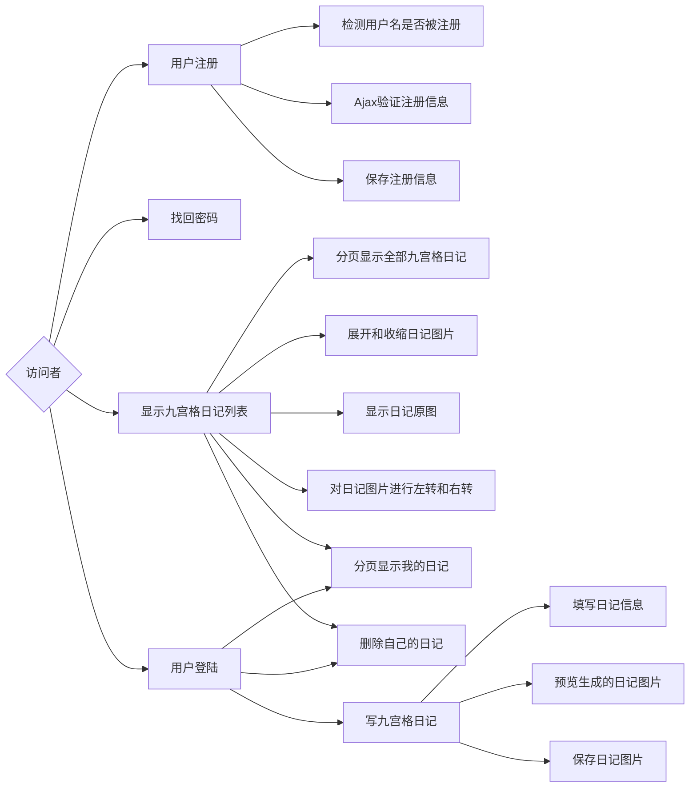

# 项目-清爽夏日九宫格日记网

## Java Web+Ajax+jQuery+MySQL 实现

- 如何应用 DIV+CSS 进行网站布局
- 如何实现 Ajax 重构
- 图片的展开和收缩的方法
- 日记图片原图的技术
- 如何进行图片的左转和右转
- 如何根据制定内容生成 PNG 图片
- 生成图片缩略图的技术
- 如何弹出灰色半透明背景的无边框窗口
- 根据文字的个数控制输出文字的尺寸
- 应用 jQuery 技术让 PNG 图片在 IE 6 下背景透明
- 配置解决中文乱码的过滤器

## 项目设计思路

### 功能阐述

3个功能模块：显示九宫格日记列表、写九宫格日记、用户模块。

显示九宫格日记列表主要用于显示全部九宫格日记、分页显示我的日记、展开和收缩日记图片、显示日记原图、对日记图片进行左转和右转以及删除自己的日记等。

写九宫格日记主要用于填写日记信息、预览生成的日记图片和保存日记图片。其中在填写日记信息时，允许用户选择并预览自己喜欢的模板，以及选择预置日记内容等。

用户模块又包括用户注册、用户登录、退出登录和找回密码等4个子功能

- 用户注册主要用于新用户注册。在进行用户注册时，系统将采用 Ajax 实现无刷新的验证和保存注册信息。
- 用户登录主要用于用户登陆网站，登陆后的用户可以查看、删除自己的日记以及写九宫格日记等。
- 退出登陆主要用于当用户忘记密码时，根据密码提示问题和答案找回密码。

### 系统预览

分页显示九宫格日记列表页面：用于填写日记信息，允许用户选择并预览自己的喜欢的模板，以及选择预置日记内容等。

写九宫格日记页面：用于填写日记信息，允许用户选择并预览自己喜欢的模板，以及选择预置日记内容等。

预览九宫格日记页面：用于浏览日记图片，如果用户满意，可以单击“保存”超链接保存日记图片，否则可以单击“再改改”超链接返回填写九宫格日记页面进行修改。

用户注册页面：该页面用于实现用户注册。在该页面中，输入用户名后，将光标移除该文本框，系统将自动检测输入的用户名是否合法（包括用户名长度及是否被注册）。如果不合法，将给出错误提示。同样，输入其他信息时，系统也将实时检测输入的信息是否合法。

### 功能结构图



访问者

- 用户注册

  - 检测用户名是否被注册
  - Ajax 验证注册信息
  - 保存注册信息
- 找回密码
- 显示九宫格日记列表
  - 分页显示全部九宫格日记
  - 展开和收缩日记图片
  - 显示日记原图
  - 对日记图片进行左转和右转
  - .
  - 分页显示我的日记
  - 删除自己的日记
- 用户登录
  - 填写九宫格日记
    - 填写日记信息
    - 预览生成的日记图片
    - 保存日记图片

### 文件夹组织结构

21——项目文件夹

​	src——保存网站中应用的Java类的源文件

​		com.wgh

​		dao——保存数据库操作类

​		filter——保存网站中应用的过滤器

​		model——保存网站中应用的JavaBean

​		servlet——保存网站中应用的Servlet

​		tools——保存工具类

​	WebContent——Web资源文件夹

​		CSS——保存网站中应用的CSS样式表文件

​		Database——保存网站的数据库文件

​		images——保存图片文件

​			diary——保存生成的日记图片

​		JS——保存网站中应用的JS文件

​		META-INF

​		WEB-INF

​			lib——保存项目中引用的Jar包

​			web.xml——Web配置文件

## 数据库和数据表设计

### 数据库设计

结合实际情况及对功能的分析，规划本项目的数据库，定义数据库名称为 db_9griddiary。主要包含两张表

db_9griddiary

​	tb_user（用户信息表）

​	tb_diary（日记表）

### 数据表设计

#### 1.  tb_user（用户信息表）

用户信息表主要用于存储用户的注册信息。用户信息表的结构如下：

**tb_user 表**

| 字段名称 | 数据类型 | 字段大小 | 是否主键 |     说明     |
| :------: | :------: | :------: | :------: | :----------: |
|    id    |   Int    |    10    |   主键   | 自动编号 ID  |
| username | Varchar  |    50    |          |    用户名    |
|   pwd    | Varchar  |    50    |          |     密码     |
|  email   | Varchar  |   100    |          |    E-mail    |
| question | Varchar  |    45    |          | 密码提示问题 |
|  answer  | Varchar  |    45    |          | 提示问题答案 |
|   city   | Varchar  |    30    |          |    所在地    |

#####  tb_user 表创建的SQL语句

phpMyAdmin自动生成的SQL

```sql
CREATE 
```


#### 2.  tb_diary（日记表）

日记表主要用于存储日记的相关信息。日记表的结构如下：

**tb_diary 表**

| 字段名称  | 数据类型  | 字段大小 | 是否主键 |      说明      |
| :-------: | :-------: | :------: | :------: | :------------: |
|    id     |    Int    |    10    |   主键   |  自动编号 ID   |
|   title   |  Varchar  |    60    |          |      标题      |
|  address  |  Varchar  |    50    |          | 日记保存的地址 |
| writeTime | Timestamp |          |          |   写日记时间   |
|  userid   |    Int    |    10    |   外键   |    用户 ID     |

在设置数据表 tb_diary 时，还需要为字段 writeTime 设置默认值，这里为 CURRENT_TIMESTAMP，也就是当前时间。

##### tb_diary 表创建的SQL语句

## 公共模块设计

在开发过程中，经常会用到一些公共模块，例如，

- 数据库连接及操作的类
- 保存分页代码的 JavaBean
- 解决中文乱码的过滤器
- 实体类
- ...

因此，在开发系统前首先需要设计这些公共模块。

下面将具体介绍清爽夏日九宫格日记网所需要的公共模块的设计过程。

### 编写数据库连接及操作的类

编写数据库连接及操作类主要用到的方法包括

- 连接数据库的方法 getConnection()
- 执行查询语句的方法 executeQuery()
- 执行更新操作的方法 executeUpdate()
- 关闭数据库连接的方法 close()

数据库连接及操作的类 **ConnDB**：

(1) 指定类 ConnDB 保存的包，并导入所需的类包，本例将其保存到 com.wgh.tools 包中。代码如下：

```java
package com.wgh.tools;			//将该类保存到 com.wgh.tools 包中
import java.io.InputStream;		//导入 java.io.InputStream 类
import java.sql.*;				//导入 java.sql 包中的所有类
import java.util.Properties;	//导入 java.util.Properties 类
```

包语句的关键字 package 后面紧跟一个包名称，然后以分号 ";" 结束；包语句必须出现在 import 语句之前；一个 java 文件只能有一个包语句。

(2) 定义 ConnDB 类，并定义该类中所需的全局变量及构造方法。代码如下：

```java
public class ConnDB {
    public Connection conn = null;  //声明 Connection 对象的实例
    public Statement stmt = null;  //声明 Statement 对象的实例
    public ResutSet rs = null;  //声明 ResultSet 对象的实例
    private static String propFileName = "connDB.properties";  //指定资源文件保存的位置
    private static Properties prop = new Properties();  //创建并实例化 Properties 对象的实例
    private static String dbClassName = "com.mysql.jdbc.Driver";  //定义保存数据库驱动的变量
    private static String dbUrl = "jdbc:mysql://127.0.0.1:3306/db_9griddiary?user=root&password=111&useUnicode=true";
    public ConnDB() {  //构造方法
        try {  //捕捉异常
            //将 Properties 文件读取到 InputStream 对象中
            InputStream in = getClass().getResourceAsStream(propFileName);
            prop.load(in);  //通过输入流对象加载 properties 文件
            dbClassName = prop.getProperty("DB_CLASS_NAME");  //获取数据库驱动
            dbUrl = prop.getProperty("DB_URL", dbUrl);  //获取连接的 URL
        } catch (Exception e) {
            e.printStackTrace();  //输出异常信息
        }
    }
}
```

---

(3) 为了方便程序移植，这里将数据库连接所需信息保存到 properties 文件中，并将该文件保存在 com.wgh.tools 包中。connDB.properties 文件的内容如下：

```bash
DB_CLASS_NAME=com.mysql.jdb.Driver
DB_URL=jdbc:mysql://126.0.0.1:3306/db_9girddiary?user=root&password=111&useUnicode=true
```

properties 文件为本地资源文本文件，以 "消息/消息文本" 的格式存放数据，使用 Properties 对象时，首先需创建并实例化该对象，代码如下：

```java
private static Properties prop = new Properties();
```

再通过文件输入流对象加载 Properties 文件，代码如下：

```java
prop.load(new FileInputStream(propFileName));
```

最后通过 Properties 对象的 getProperty() 方法读取 properties 文件中的数据。

---

(4) 创建连接数据库的方法 getConnection()，该方法返回 Connection 对象的一个实例。getConncetion() 方法的代码如下：

```java
public static Connection getConnection() {
    Connection conn = null;
    try {  //连接数据库时可能发生异常，因此需要捕捉该异常
        Class.forName(dbClassName).newInstance();  //装载数据库驱动
        conn = DriverManager.getConnection(dbUrl);  //建立与数据库 URL 中定义的数据库的连接
    } catch (Exception ee) {
        ee.printStackTrace();  //输出异常信息
    }
    if (conn == null) {
        System.err.println("警告: DbConnectionManager.getConnection() 获得数据库连接失败.\r\n 连接类型:" + dbClassName + "\r\n 链接位置:" + dbUrl);  //在控制台上输出提示信息
    }
    return conn;  //返回数据库连接对象
}
```

```java
Class.forName(dbClassName).newInstance(); 
//该句代码用于利用 Class 类中的静态方法 forName()，加载要使用的 Driver，使用该语句可以将传入的 Driver 类名称的字符串当作一个 Class 对象，通过 newInstance() 方法可以建立此 Class 对象的一个新实例。
```

```java
conn = DriverManager.getConnection(dbUrl);
```

DriverManager 用于管理 JDBC 驱动程序的接口，通过其 getConnection() 方法来获取 Connection 对象的引用。Connection 对象的常用方法如下：

- [ ] Statement createStatement():  创建一个 Statement 对象，用于执行 SQL 语句。
- [ ] close():  关闭数据库的连接，在使用完连接后必须关闭，否则连接会保持一段比较长的时间，直到超时。
- [ ] PreparedStatement prepareStatement(String sql):  使用指定的 SQL 语句创建了一个预处理语句，sql 参数中往往包含一个或多个 "?" 占位符。
- [ ] CallableStatement prepareCall(String sql):  创建一个 CallableStatement 用于执行存储过程，sql 参数是调用的存储过程，中间至少包含一个 "?" 占位符。

---

(5)  


